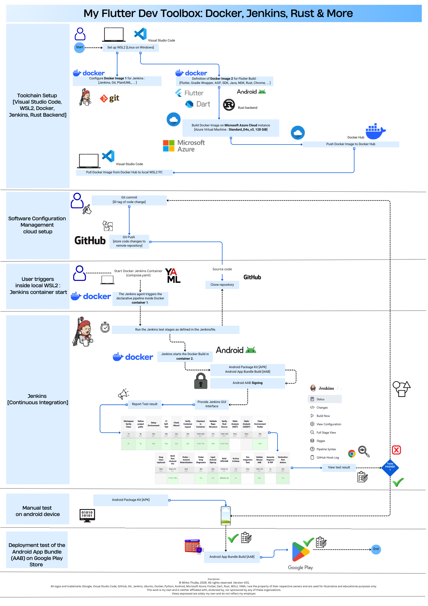

# A new sudoku android project :
- A Flutter project for Android which is programmed in DART language
- The App uses a RUST backend connected via FFI interface
- Visual Studio Code is used as Editor
- Two docker container are used.
-- A docker container to coordinate the build via jenkins
-- A second container to provide a clean and reproducable flutter build environment

# The app : 
Sudoku training app as a study project to gain skills in Android App development tools with RUST backend.

# Workflow : 

# Project documentation : 
- README.md	Entry point (first impression)

- GitHub Wiki	Detailed knowledge base
    - Home
        - System Overview
        - Toolchain Overview
        - Docker Architecture
        - Jenkins Pipeline
        - Android Build System
        - Release Process
        - Secrets & Signing
        - Troubleshooting
        - Architecture Decisions
    - PlantUML	Visual architecture & process explanation
